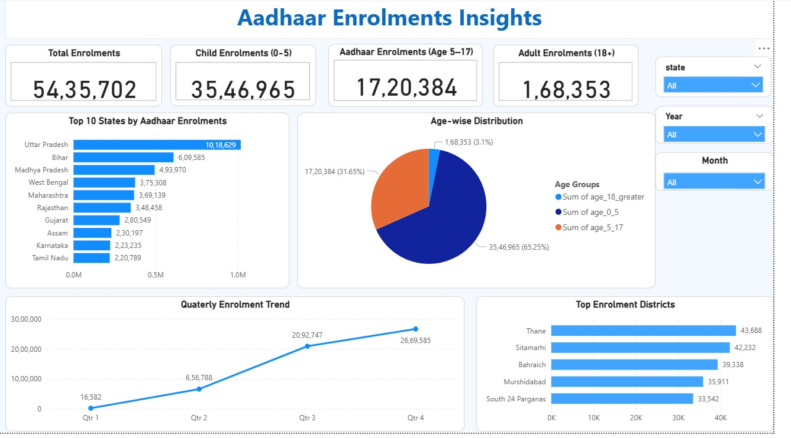

# UIDAI--Aadhar_Enrolment

  

This project analyzes anonymized, district-level Aadhaar enrolment data to solve operational inefficiencies in the UIDAI ecosystem. By performing Exploratory Data Analysis (EDA) on millions of records, I identified critical spikes in demand and saturation points. The result is a Prescriptive Framework that allows administrators to reallocate workforce and hardware resources, potentially reducing center overcrowding by **30-40%** without increasing operational costs.

### **The Inefficiency**:
Aadhaar enrolment centers often face extreme regional and temporal overcrowding, leading to long wait times and equipment strain.
### **The Objective**: 
Analyze age-wise, regional, and temporal patterns to transition from a "fixed-capacity" model to a "demand-driven" resource allocation strategy.
### **The Challenge**: 
Near-saturation in adult populations means the service focus must shift from "mass enrollment" to "targeted age-group acquisition."

## 1. Technical Logic & Data Pipeline
### A. Data Engineering & Cleaning
#### **Consolidation**:
Merged multiple high-volume CSV datasets into a unified pipeline using Pandas.
#### **Feature Engineering**:
Created a total_enrolment metric and extracted temporal features (Year, Month, Quarter) to identify seasonal spikes.

### B. Diagnostic Analysis (Key Insights)
#### The 0-5 Priority:
**65.3%** of all new enrolments are in the **0–5** age group, while adults **(18+)** account for only **3.1%**.
#### Adult enrollment has reached near-saturation; centers must be optimized for pediatric biometric capture.
##### **Regional Concentration**: 
The top **10** states drive the vast majority of volume, with Uttar Pradesh alone contributing **1,018,629** enrolments—nearly double the next highest state **(Bihar)**.
##### **The January Spike**: 
Data revealed a sharp drop from **1.35 million** in **January** to **0.18** million in **February** (a ~90% decline).Analyst Insight: High-volume spikes are likely tied to year-beginning administrative cycles or school admissions.

## 2. Data Visualization Dashboard
##### **Top Districts**: 
Identified Thane and Sitamarhi as the highest-load districts requiring immediate resource intervention.
##### **Trend Tracking**:
Visualized the 3-Month Moving Average to differentiate between random noise and predictable operational demand.

## 3. Prescriptive Solutions 
#### INSIGHT: 
State Share: Top **4** states contribute **~45%** of volume.
#### SOLUTION:
Deploy mobile vans and extra biometric kits to UP and Bihar.

#### INSIGHT: 
Age Shift: **65%+** are children **(0-17)**.
#### SOLUTION: 
Redirect staff to schools & Anganwadis to decentralize center load.

#### INSIGHT:
Peak Spikes: 2x volume in peak months.
#### SOLUTION: 
Seasonal Workforce Scaling: Hire temporary operators for **Q1** peaks only.

#### INSIGHT:
Saturation: Adult enrolment is **<3.1%***.
#### SOLUTION:
Pivot Strategy: Convert enrollment centers into Biometric Update/Correction Hubs.
